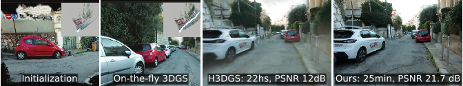
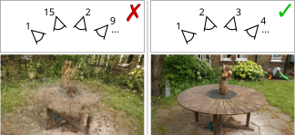
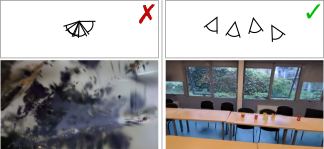
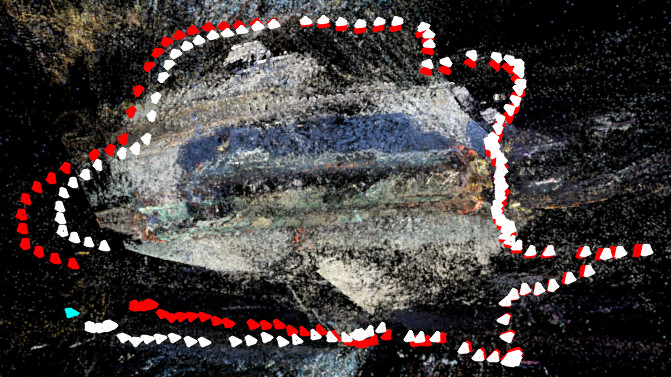
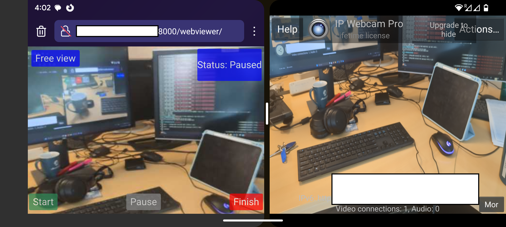
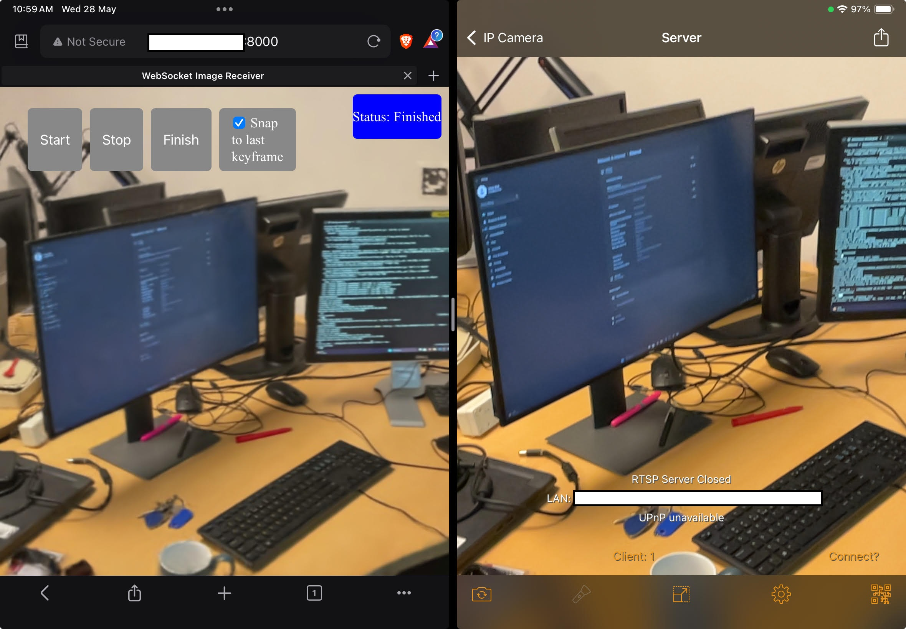

# On-the-fly Reconstruction for Large-Scale Novel View Synthesis from Unposed Images
[Andreas Meuleman](https://ameuleman.github.io/), 
[Ishaan Shah](https://ishaanshah.xyz/), 
[Alexandre Lanvin](https://scholar.google.com/citations?hl=fr&user=e1s7mGsAAAAJ), 
[Bernhard Kerbl](https://snosixtyboo.github.io/), 
[George Drettakis](https://www-sop.inria.fr/members/George.Drettakis/)

### [Project page](https://repo-sam.inria.fr/nerphys/on-the-fly-nvs/) | [Paper](https://repo-sam.inria.fr/nerphys/on-the-fly-nvs/onthefly_nvs.pdf) | [Data](https://repo-sam.inria.fr/nerphys/on-the-fly-nvs/datasets/)



**Table of contents**: [Setup](#setup) | [Data Guidelines](#data-guidelines) | [Optimization](#optimization) | [Evaluation](#evaluation) | [Viewers](#interactive-viewers) | [Capture Guidelines](#capture-guidelines) | [Video Stream](#video-stream) | [Acknowledgments](#acknowledgments)

We propose a fast, on-the-fly 3D Gaussian Splatting method that jointly estimates poses and reconstructs scenes. Through fast pose initialization, direct primitive sampling, and scalable clustering and merging, it efficiently handles diverse ordered image sequences of arbitrary length.

<!-- Institutions logos -->
<div align="center">
  <a href="https://www.inria.fr/">
    
  </a>
  <a href="https://univ-cotedazur.eu/">
    <picture>
      <source media="(prefers-color-scheme: dark)" width="28%" hspace="2%" srcset="assets/uca_logo_dark.svg">
      
    </picture>
  </a>
  <a href="https://www.tuwien.at/en/">
    
  </a>
</div>
<br>
<a href="https://team.inria.fr/graphdeco/">
  <picture>
    <source media="(prefers-color-scheme: dark)" width="23.5%" hspace="2%" srcset="assets/graphdeco_logo_dark.svg">
    
  </picture>
</a>
<a href="https://project.inria.fr/nerphys/">
  <picture>
    <source media="(prefers-color-scheme: dark)" width="16.5%" hspace="2%" srcset="assets/erc_logo_dark.svg">
    
  </picture>
</a>

## Citation
If you find this code useful in a publication, please use the following citation:
```
@article{meuleman2025onthefly,
  title={On-the-fly Reconstruction for Large-Scale Novel View Synthesis from Unposed Images},
  author={Meuleman, Andreas and Shah, Ishaan and Lanvin, Alexandre and Kerbl, Bernhard and Drettakis, George},
  journal={ACM Transactions on Graphics},
  volume={44},
  number={4},
  year={2025}
}
```

## Setup 
Tested on Ubuntu 22.04 and Windows 11 with PyTorch 2.7.0, and CUDA 11.8 and 12.8.
<br>
Create the environment:
```bash
git clone --recursive https://github.com/graphdeco-inria/on-the-fly-nvs.git
cd on-the-fly-nvs
conda create -n onthefly_nvs python=3.12 -y
conda activate onthefly_nvs
```
Default setup with CUDA 12.8 (check your compute platform with `nvcc --version`):
```pwsh
# Windows Only
SET DISTUTILS_USE_SDK=1 # (If you use cmd.exe)
$env:DISTUTILS_USE_SDK=1 # (If you use PowerShell)
```
```bash
# Get the versions corresponding to your compute platform at https://pytorch.org/
pip install torch torchvision xformers --index-url https://download.pytorch.org/whl/cu128
pip install cupy-cuda12x
pip install -r requirements.txt
```

<details>
<summary>Setup with CUDA 11.8</summary>
Note that <code>xformers</code> will not be installed with CUDA 11.8 because it requires a version of PyTorch that is incompatible with our codebase.
<pre><code>pip install torch torchvision --index-url https://download.pytorch.org/whl/cu118
pip install cupy-cuda11x
pip install -r requirements.txt
</code></pre>
</details>

<details>
<summary>Installing CUDA within a Conda Environment</summary>
If <code>nvcc --version</code> returns an error, you can install CUDA within your Conda environment. 
After activating your environment and before installing PyTorch, run:
<pre><code>conda install nvidia/label/cuda-12.8.0::cuda-nvcc
</code></pre>
Make sure to replace <code>12.8.0</code> with a version supported by your driver (check maximum version with <code>nvidia-smi</code>). A list of the available versions can be found <a href="https://anaconda.org/nvidia/cuda-nvcc">here</a>.
</details>

<details>
<summary>Specifying Environment Path</summary>
You can specify paths for Conda to save space on your system drive:
<pre><code>conda config --add pkgs_dirs &lt;pkg_path&gt;
conda create python=3.12 -y --prefix &lt;env_path&gt;/onthefly_nvs
conda activate &lt;env_path&gt;/onthefly_nvs
</code></pre>
Where <code>&lt;pkg_path&gt;</code> is the desired package download location and <code>&lt;env_path&gt;/onthefly_nvs</code> is the desired environment location.
</details>

## Data Guidelines
> Please note that our method **is not a drop-in replacement for COLMAP + 3DGS, as it does not reorder images**. We require sequential capture that implies several constraints on the kind of data that can be handled. Please follow the **[Capture Guidelines](#capture-guidelines) for best results on your own data.**

The dataloader will look for images in `${SOURCE_PATH}/images` by default. The images should be ordered alphabetically and have a `.png`, `.jpg` or `.jpeg` extension.
It will also optionally look for [COLMAP files](https://colmap.github.io/format.html) in `${SOURCE_PATH}/sparse/0` for ground truth poses visualization.

To download the datasets used in Table 1 of the paper, run:
```bash
# All datasets will be downloaded in data/
python scripts/download_datasets.py --out_dir data/

# Or download a specific dataset
python scripts/download_datasets.py --out_dir data/ --datasets MipNeRF360 # or TUM, or StaticHikes
```

For best results, we recommend using a high-quality camera and providing still photographs to the method. We provide an experimental prototype for reconstruction from a [Video Stream](#video-stream) that will not provide the same level of quality.

## Optimization
The following command runs the reconstruction and saves the model. If `-m` is not provided, the model will be saved in `results/xxxxxx/`.
```bash
python train.py -s ${SOURCE_PATH} -m ${MODEL_PATH}
```
This command uses *all* input images, which provides the best result. Metrics in the paper are computed with evaluation protocol below (see [Evaluation](#evaluation)). See also the [Interactive Viewers](#interactive-viewers) section below for direct feedback on your training.
<br>
Example basic training command (see [Data Guidelines](#data-guidelines) for downloading the dataset):
```bash
python train.py -s data/MipNeRF360/garden -m results/MipNeRF360/garden
```
<details>
<summary><span style="font-weight: bold;">Main Command Line Arguments for train.py</span></summary>

  #### --source_path / -s
  Path to the data folder (should have sparse/0/ if using COLMAP or evaluating poses).
  #### --model_path / -m
  Directory to store the renders from test view and checkpoints after training. If not set, will be set to `results/xxxxxx`.
  #### --images_dir / -i
  `source_path/images_dir/` is the path to the images (with extensions jpg, png or jpeg). If not set, will use source_path/images.
  #### --masks_dir
  If set, `source_path/masks_dir/` is the path to optional masks to apply to the images before computing the loss (the format expected is png).
  #### --viewer_mode
  Running mode for the viewer, choices are [`local`, `server`, `web`, `none`], `none` by default. See [Interactive Viewers](#interactive-viewers) for more details.
  #### --ip
  IP address of the viewer client, if using server viewer_mode, `0.0.0.0` by default.
  #### --port
  Port of the viewer client, if using "server" `viewer_mode`, `6009` by default.
  #### --downsampling
  Downsampling ratio for input images.
  #### --save_every
  Frequency of exporting renders w.r.t input frames.
  #### --save_at_finetune_epoch
  Enable finetuning after the initial on-the-fly reconstruction and save the scene at the end of the specified epochs when fine-tuning.
  #### --eval_poses
  Compare poses to COLMAP.
  #### --use_colmap_poses
  Load COLMAP data for pose and intrinsics initialization.
  #### --test_hold
  Holdout for test set, will exclude every test_hold image from the Gaussian optimization and use them for testing. The test frames will still be used for training the pose. If set to -1, no keyframes will be excluded from training.
  #### --test_frequency
  Test and get metrics every test_frequency keyframes.
  #### --display_runtimes
  Display runtimes for each step in the tqdm bar.

</details>

>Run `python train.py -h` for a complete list of available options.

## Evaluation
The following command runs the reconstruction while excluding every `${TEST_HOLD}`-th image from the Gaussian optimization. It evaluates and saves the test images to `${MODEL_PATH}/test_images` at the end of training.
```bash
python train.py -s ${SOURCE_PATH} -m ${MODEL_PATH} --test_hold ${TEST_HOLD}
```
Example (see [Data Guidelines](#data-guidelines) for downloading the dataset):
```bash
python train.py -s data/MipNeRF360/garden -m results/MipNeRF360/garden --test_hold 8 --test_frequency 20
```

To evaluate all scenes reported in Table 1 of the paper, run:
```bash
python scripts/train_eval_all.py --base_dir data/ --base_out_dir results/
```

## Interactive Viewers
The viewers allow navigation of the scene during and after optimization, and visualization of both optimized and ground truth poses. `W, A, S, D, Q, E` control camera translation and `I, K, J, L, U, O` control rotation. We release the base viewer components in a [separate repository](https://github.com/graphdeco-inria/graphdecoviewer) so that they can be used in other projects. If you find it useful, please consider citing it.


https://github.com/user-attachments/assets/a94130f0-8f93-46e2-844b-f4b6fcae8a0b


### Live Optimization Viewer
To open an interactive viewer window during the optimization process, use the following command:

```bash
python train.py -s ${SOURCE_PATH} --viewer_mode local
```
Example (see [Data Guidelines](#data-guidelines) for downloading the dataset):
```bash
python train.py -s data/MipNeRF360/garden --viewer_mode local
```

This viewer operates concurrently with the optimization process. You can enable throttling by clicking the `Throttling` checkbox and adjust the `Max FPS` slider in the viewer to balance resource allocation between the viewer and the optimization task. Enabling the live optimization viewer will keep the optimization process running after the training is complete.

### Visualizing a Reconstructed Scene
After [optimization](#optimization), you can visualize the reconstructed scene using the following command:
```bash
python gaussianviewer.py local ${MODEL_PATH}
```
Example:
```bash
python gaussianviewer.py local results/MipNeRF360/garden
```

### Network Viewer

The network viewer allows you to visualize a scene and monitor the optimization process from a different machine. The client waits for the server program to connect and stream rendered images.

To run the client, use the following command:
```bash
python gaussianviewer.py client
```
On the server side, run one of the following commands:
```bash
# live optimization visualization
python train.py -s ${SOURCE_PATH} --viewer_mode server

# or
# visualize a reconstructed scene
python gaussianviewer.py server ${MODEL_PATH}
```

When using different machines, ensure the specified port is forwarded or set `--ip` and `--port` appropriately for both the client and server.

<details>
<summary><span style="font-weight: bold;">Lightweight Remote Viewer Environment</span></summary>
The remote viewer has fewer dependencies, making it convenient to run on a different machine than the one performing the optimization. Since rendering occurs on the host machine, the client machine does not need a CUDA-compatible GPU.

To set up the remote viewer on a different machine, follow these steps:
```bash
conda create -n onthefly_nvs_remoteviewer python=3.12 -y
conda activate onthefly_nvs_remoteviewer
pip install submodules/pythonviewer
```
</details>

**Note**: On the first run, the settings window might be hidden behind the `Point View` window. Move the window to reveal it. The updated layout will be stored when the viewer is closed for future runs.

## Render a Video from an Optimized Scene
The following command renders the reconstruction saved in `${MODEL_PATH}` along the path `${RENDER_PATH}` and exports the frames and video in `${VIDEO_DIR}`. The camera trajectory files in `${RENDER_PATH}` must follow the [COLMAP format](https://colmap.github.io/format.html) (`images.[bin/txt]` and `cameras.[bin/txt]`).
```bash
python scripts/render_path.py -m ${MODEL_PATH} --render_path ${RENDER_PATH} --out_dir ${VIDEO_DIR}
```
Here, we render the reconstruction of the garden scene along the optimized poses (that `train.py` saves in `${MODEL_PATH}/colmap`):
```bash
python scripts/render_path.py -m results/MipNeRF360/garden \
                              --render_path results/MipNeRF360/garden/colmap \
                              --out_dir results/MipNeRF360/garden/video
```

<details>
<summary><span style="font-weight: bold;">Aligning Render Path</span></summary>
The poses in <code>${RENDER_PATH}</code> may be in a different coordinate system than the optimized scene, so we provide an optional argument <code>--alignment_path</code> to align it to the scene. 
Specifically, we find a transformation between the cameras in <code>&lt;alignment_path&gt;</code> and the scene keyframes, and apply this transformation to the cameras in <code>${RENDER_PATH}</code>. 
Note that the image names corresponding to the poses in <code>&lt;alignment_path&gt;</code> should match the image names used to optimize the scene.
This is useful for rendering a camera path that has been captured on a different viewer and method (e.g. 3DGS and SIBR) and ensure the rendered video paths match.
</details>

## Capture Guidelines
As mentioned above, our method *is not a drop-in replacement for COLMAP and 3DGS*. In particular, for efficiency and to allow live feedback, we do not perform exhaustive matching or reorder the input images like SfM approaches such as COLMAP. Many standard datasets used in previous work thus *cannot be handled* by our approach (e.g., Zip-NeRF scenes, or most MipNeRF360 scenes such as bicycle).

It is important to carefully follow the guidelines below for the method to work and to achieve good results:
* **Ordered Sequences**: Capture images sequentially with sufficient overlap. Ideally, consecutive frames should share >2/3rd of their content. This typically involves walking slowly around a scene and taking pictures sequentially. This works very well for outdoors scenes where one naturally moves forward; for indoors scenes, restrictions in space often lead to errors. Please see below on what to avoid. 
Again, unordered datasets (e.g., Zip-NeRF-style, many DeepBlending scenes, etc.) are not supported.
* **Translation**: Ensure sufficient translation between consecutive frames for accurate triangulation. 
Avoid rotation without translation: taking a step sideways between pictures when turning helps maintain a sufficient baseline, especially indoors. 
This is critical for bootstrapping, as an insufficient translation can lead to incorrect focal length estimation, but is also important throughout capture.
* **Resolution**: We found that the matcher performs best within the 1-2MP range.
* **Pinhole Camera Model**: We optimize only for focal length, so ensure your images follow a pinhole projection with centered principal point (no fisheye/distortion).
* **No Loop Closure**: Drift compensation is not performed when the trajectory revisits a previously reconstructed region. This can cause misalignments due to accumulated pose errors, especially after registering a long sequence between the start and end of the loop. For small loops (e.g., the Truck scene from the T and T dataset) our method works well.

### Example Failure Cases:
<table>
  <tr>
    <td width="40%" valign="top">
      <picture>
        <source width="100%" media="(prefers-color-scheme: dark)" srcset="assets/ordered_dark.svg">
        
     </picture>
      <sup>The reconstruction fails when the sequence is not ordered or if there is not enough overlap between consecutive frames.</sup>
    </td> 
    <td width="40%" valign="top">
      <picture>
        <source width="100%" media="(prefers-color-scheme: dark)" srcset="assets/baseline_dark.svg">
        
     </picture>
      <sup>Bootstrapping fails when there is high rotation but small translation.</sup>
    </td>
    <td width="25%" valign="top">
      
      <sup>Drift is not corrected when the trajectory loops (estimated poses in white, ground truth in red).</sup>
    </td>
  </tr>
</table>

## Video Stream
We provide a proof-of-concept setup for reconstructing a scene from a video stream with live feedback. 
Due to lower image quality and limited control over capture conditions, reconstructions may be less satisfactory than with images carefully captured following the guidelines above using a high-quality camera. 
Reconstruction quality also depends heavily on camera quality and network speed, with poor connectivity causing motion blur and compression artifacts.

### 1. Setting up a Stream
To set up a stream from a phone, we found [IP Webcam (For Android)](https://play.google.com/store/apps/details?id=com.pas.webcam) and [IP Camera Lite (For iOS / iPadOS)](https://apps.apple.com/us/app/ip-camera-lite/id1013455241) to be a simple solution. We found that the method works best with wide angle camera at 1080p resolution. 

#### Settings for IP Webcam (Android)
Using "Video Preferences", select the widest camera of your device. Set the resolution to be `1920x1080` and video orientation to be "Landscape". You could also enable background streaming in the "Optional Permissions" menu. Finally start the server using "Start Server". You can optionally select "Run in Background" in "Actions" menu which will keep the stream running when the application is put into background. 

#### Settings for IP Camera Lite (iOS / iPadOS)
In the "Settings" menu go the the "Video overlay" menu and uncheck the "Display Server Timestamp", "Display Camera Name" and "Display Battery Info" options. Delete the username and password in the RTSP settings to disable authentication.
Then start the the server by clicking "Turn on IP Camera Server". Before starting the reconstruction, disable the "Multi-Cam" option in the "Settings" menu. Set the video resolution to `1920x1080` and choose the widest camera.

#### General Instructions
You can visit the stream URL at `http://<ip>:<port>/video` (replace `<ip>` and `<port>` with the values shown in the app) on your browser to check the stream and modify any settings if needed. IP Camera Lite adds a watermark to the stream which might affect the reconstruction quality.

### 2. Setting up the Web Viewer
We provide a simple web viewer for live feedback on the mobile device running the video stream app. 
To access the web viewer from another machine from the one running the reconstruction you will need to allow access to the TCP ports 6009 and 8000:
<details>
<summary><span style="font-weight: bold;">Ubuntu Firewall Settings</span></summary>
The following command will allow access to the TCP ports 6009 and 8000. 
<br> 
Note that different Linux distributions have different firewall management software.
<pre><code>sudo ufw allow 8000/tcp
sudo ufw allow 6009/tcp
sudo ufw enable
sudo ufw status
</code></pre>
If successful, the output should include the following lines:
<pre><code>8000/tcp                   ALLOW       Anywhere                  
6009/tcp                   ALLOW       Anywhere                  
</code></pre>
</details>
<details>
<summary><span style="font-weight: bold;">Fedora Firewall Settings</span></summary>
The following command will allow access to the TCP ports 6009 and 8000. 
<br> 
Note that different Linux distributions have different firewall management software.
<pre><code>sudo firewall-cmd --add-port 8000/tcp --permanent
sudo firewall-cmd --add-port 6009/tcp --permanent
</code></pre>
</details>
<details>
<summary><span style="font-weight: bold;">Windows Firewall Settings</span></summary>
  <ol>
    <li>Press <code>Windows + R</code>, type <code>wf.msc</code>, and hit Enter.</li>
    <li>In the left pane, click <strong>Inbound Rules</strong>.</li>
    <li>In the right pane, click <strong>New Rule</strong>.</li>
    <li>Select <strong>Port</strong>, then click <strong>Next</strong>.</li>
    <li>Select <strong>TCP</strong>, enter <code>6009, 8000</code>, click <strong>Next</strong>.</li>
    <li>Choose <strong>Allow the connection</strong>, then click <strong>Next</strong>.</li>
    <li>Check all profiles (<strong>Domain</strong>, <strong>Private</strong>, <strong>Public</strong>), click <strong>Next</strong>.</li>
    <li>Name the rule (e.g., <code>WebViewer 6009, 8000</code>), then click <strong>Finish</strong>.</li>
  </ol>
</details>

On the phone or tablet, open a browser in split screen mode side-by-side (only supported on Android and iPadOS) with the [stream app](#1-setting-up-a-stream). 
Enter `http://<ip>:8000/webviewer` in the browser, where `<ip>` is the IP address of the computer running the reconstruction server (The page will only load after running the train script). Find the IPv4 address by running `ifconfig` (Ubuntu) or `ipconfig` (Windows) in the command prompt.

### 3. Starting the Reconstruction Server
Run the reconstruction script with the webviewer mode:
```bash
python train.py -s ${STREAM_URL} --downsampling=1.5 --viewer_mode web
``` 
> **Note:** We found that setting the stream to 1080p resolution before downsampling by a factor of 1.5 mitigates the impact of compression artifacts.

### 4. Starting the Reconstruction from the Mobile Device
After the previous steps, the brower on the mobile devide should show the webviewer. Click the "Start" button to start the reconstruction.

<table>
  <tr width="50%">
    <td width="60%">
      
      <sup>
        Live reconstruction on Android using IP Webcam in split screen mode with browser connected to the webviewer.
      </sup>
    </td>
    <td width="40%">
      
      <sup>
        Live reconstruction on iPad using IP Camera Lite in split screen mode with browser connected to the webviewer.
      </sup>
    </td>
  </tr>
</table>

Live 3D reconstruction on Android: the input video stream (left) and the browser-based preview (right) shown in split-screen mode:


https://github.com/user-attachments/assets/71e94ae1-012d-417e-b11d-754d07a31772

Live reconstruction monitored with the remote viewer:

https://github.com/user-attachments/assets/f484e3b9-0dfc-48e9-b05d-f0cf30114ad7

## Acknowledgments
This work was funded by the European Research Council (ERC) Advanced Grant NERPHYS, number 101141721 [https://project.inria.fr/nerphys/](https://project.inria.fr/nerphys). The authors are grateful to the OPAL infrastructure of the Université Côte d'Azur for providing resources and support, as well as Adobe and NVIDIA for software and hardware donations. This work was granted access to the HPC resources of IDRIS under the allocation AD011015561 made by GENCI.
Bernhard Kerbl has received funding by WWTF (project ICT22-055 - Instant Visualization and Interaction for Large Point Clouds).
Thanks to Peter Hedman for early comments and suggestions, George Kopanas for proofreading a draft, and Jeffrey Hu for setting up the phone-based capture.
